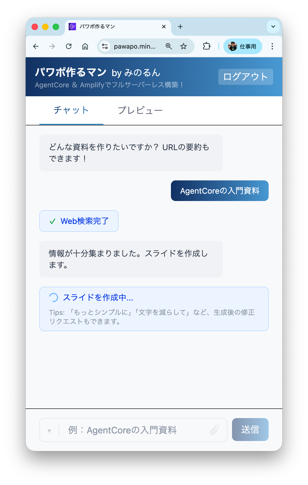
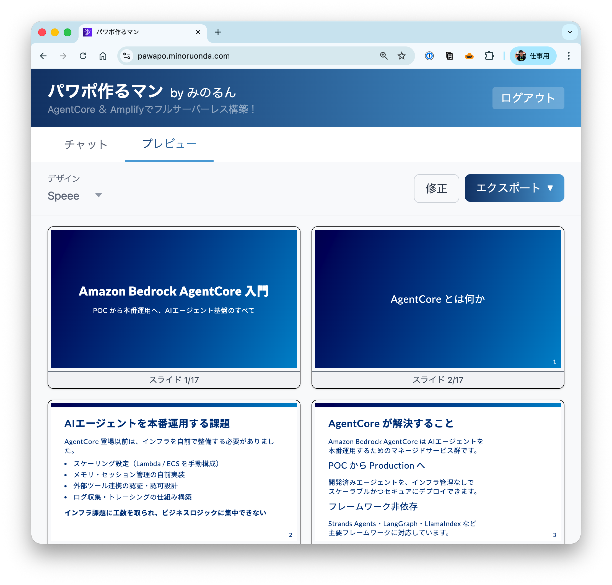

# パワポ作るマン　by みのるん

新規アカウント作成すれば、誰でも使えます！

※1日50名を超えるとエラーになります。その際は翌日までお待ちください🙏

[pawapo.minoruonda.com](https://pawapo.minoruonda.com/)

<p align="center">
  
  
</p>


## アーキテクチャ

AWSの最新サービスを活用して、フルサーバーレスで構築。Claude Sonnet 4.6、GPT-5.6 Sol、Kimi K2.5を用途に応じて選べます。維持費の中心はAmazon Bedrockのモデル推論料金です。


## デプロイ手順

自分のAWS環境にデプロイする場合の手順です。

### 前提条件

- ARMアーキテクチャのPC（MacBookなど）
- Node.js 18以上
- Docker Desktop（起動しておく）
- AWSアカウント
  - リージョンはバージニア/オレゴン/東京のいずれか（GPT-5.6 SolのMantle接続先はバージニア北部）
  - BedrockプレイグランドからClaudeのユースケース送信をしておく
- [Tavily](https://tavily.com/) APIキー（無料、Web検索機能に必要）

### 1. セットアップ

```bash
git clone --single-branch https://github.com/minorun365/marp-agent.git
cd marp-agent
npm install
```

### 2. 環境変数の設定

プロジェクトルートに `.env` ファイルを作成：

```
TAVILY_API_KEYS=tvly-xxxxx,tvly-yyyyy,tvly-zzzzz
```

※カンマ区切りで複数キーを指定すると、レートリミット時に自動フォールバックします。

### 3. sandbox環境で起動（ローカル開発）

```bash
aws login
npx ampx sandbox
```

`aws login` でデプロイ先リージョン（バージニア/オレゴン/東京）のAWSアカウントに認証してください。

初回はCloudFormationスタックの作成に数分かかります。完了すると `amplify_outputs.json` が生成されます。

別ターミナルでフロントエンドを起動：

```bash
npm run dev
```

### 4. 本番環境へのデプロイ（Amplify Console）

1. AWSマネコンでAmplifyアプリを作成
1. GitHubリポジトリをAmplify Consoleに接続
2. **ビルドイメージを変更**（Docker対応のため）：
   - Build settings → Build image settings → Custom Build Image
   - `public.ecr.aws/codebuild/amazonlinux-x86_64-standard:5.0`
3. **環境変数を設定**（Amplify Console → Environment variables）：
   - `TAVILY_API_KEYS` = 取得したAPIキー（カンマ区切りで複数指定可）
4. デプロイを実行

## 参考ブログ

- [アンチAI生成派の私が、パワポ作成AIを作った理由 - Findy Media](https://findy-code.io/media/articles/aisaji-minorun365)
- [Amplify & AgentCoreのAIエージェントをAWS CDKでデプロイしよう！ - Qiita](https://qiita.com/minorun365/items/0b4a980f2f4bb073a9e0)
