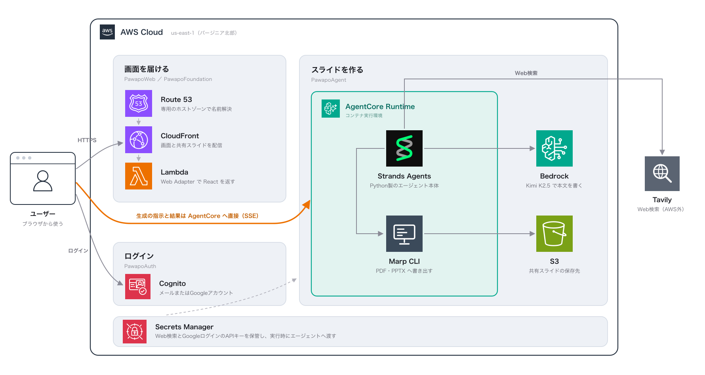

# パワポ作るマン　by みのるん

新規アカウント作成すれば、誰でも使えます！

※1日50名を超えるとエラーになります。その際は翌日までお待ちください🙏

[pawapo.minoruonda.com](https://pawapo.minoruonda.com/)

<p align="center">
    
    
</p>


## できること

- 作りたい内容を伝えると、AIがMarp形式のスライドを書き起こします
- テーマは4種類（beam / border / gradient / speee）から選べます
- 生成しながら文字のはみ出しを検査して、あふれたスライドを自動で作り直します
- PDF・PPTX・編集可能なPPTXで書き出せます
- 共有URLを発行して、スライドをそのまま人に見せられます
- 必要に応じてWeb検索し、内容の裏取りをしたうえで書きます
- できあがったスライドを紹介するX（旧Twitter）の投稿文を作れます


## アーキテクチャ

公開中のアプリは、CloudFront から画面を配信し、ブラウザが Amazon Bedrock AgentCore Runtime へ直接つながる構成です。標準モデルは Grok 4.6（Bedrock Mantle 経由）です。維持費の中心は Bedrock の推論料金です。インフラは AWS CDK を CDKD でデプロイします。

構成の解説は [新基盤のアーキテクチャ](docs/new-architecture.html) にあります。

Git への push では本番 AWS は変わりません。本番反映は CDKD を明示実行します。

Amplify Gen2 の自己ホスト手順は [`legacy/amplify`](https://github.com/minorun365/marp-agent/tree/legacy/amplify) ブランチに残しています。



CDK は次の6スタックに分かれています。差分を確認するときは、触ったつもりのないスタックが `No changes` のままかを見てください。

| スタック | 役割 |
|---|---|
| `PawapoFoundation` | ドメイン、証明書、シークレット、予算アラート |
| `PawapoAuthAccess` | 認証まわりのLambda実行ロールとログ |
| `PawapoAuth` | Cognitoユーザープールとクライアント |
| `PawapoWorkloadAccess` | AgentCore・Webの実行ロールとログ |
| `PawapoAgent` | AgentCore Runtime（エージェント本体） |
| `PawapoWeb` | CloudFront配信と共有スライド配信 |


## デプロイ手順

自分のAWS環境に載せる場合の手順です。このリポジトリのデフォルト設定は作者の公開アプリ向けなので、ドメインなどの CDK context は自分の環境に合わせてください。

### 前提条件

- ARMアーキテクチャのPC（MacBookなど）
- Node.js 20.19以上（Vite 7 の要求バージョン）
- Docker Desktop（起動しておく）
- AWSアカウント（リージョンはバージニア北部 `us-east-1`）
  - Bedrockプレイグラウンドから利用するモデルのユースケース送信をしておく
- 自分で管理しているドメイン（CloudFront の配信に使います）
- [Tavily](https://tavily.com/) APIキー（無料、Web検索機能に必要）

### 1. セットアップ

```bash
git clone https://github.com/minorun365/marp-agent.git
cd marp-agent
npm install
```

### 2. CDK context を自分の環境に合わせる

`cdk.json` の `context` を書き換えます。指定しなかった任意の項目は、その機能ごと作られません。

| context | 要否 | 内容 |
|---|---|---|
| `appDomain` | 必須 | アプリを公開するドメイン |
| `previewDomain` | 任意 | 本番切替前に確認する用のドメイン |
| `domainReady` | 任意 | `true` にすると `appDomain` を配信に割り当てます。証明書のDNS検証を通してから有効にしてください |
| `budgetEmail` | 任意 | 予算アラートの通知先メールアドレス |
| `monthlyBudgetUsd` | 任意 | 月額予算（既定は100ドル） |
| `googleClientId` | 任意 | Googleログインを使う場合のクライアントID |
| `cognitoDomainPrefix` | 任意 | Googleログインを使う場合は必須。Cognitoのホストドメイン接頭辞 |
| `oldUserPoolId` / `oldUserPoolClientId` / `oldMigrationRoleArn` | 任意 | 既存のCognitoからユーザーを引き継ぐ場合に3つセットで指定 |
| `oldGoogleCheckRoleArn` | 任意 | 引き継ぎ元でGoogleアカウントを照合する場合のロールARN |
| `cutoverWildcardDomain` | 任意 | 別環境から無停止で切り替える場合のワイルドカードドメイン |

新規に構築する場合、必要なのは `appDomain` だけです。移行用の context は、旧環境を持っている場合のみ指定してください。

### 3. デプロイ

```bash
npm run infra:bootstrap   # そのAWSアカウントで初回のみ
npm run infra:synth
npm run infra:diff
npm run infra:dry-run
npm run infra:deploy
```

ドメインは `PawapoFoundation` が専用のホストゾーンを作るので、レジストラ側のネームサーバーをそこへ向けてください。ACM証明書はDNS検証なので、検証用のCNAMEを登録すると発行されます。

⚠️ **`cdk.json` の context を落としたまま実行すると、その機能のリソースが削除差分として出ます。** 必ず `infra:diff` で、変更したはずのないスタックが `No changes` になっていることを確認してからデプロイしてください。

### 4. APIキーを入れる

シークレットの入れ物は `PawapoFoundation` が作るので、デプロイ後に値を入れます。

```bash
aws secretsmanager put-secret-value --secret-id pawapo/tavily-api-keys --secret-string 'tvly-xxxxx,tvly-yyyyy'
```

カンマ区切りで複数キーを指定すると、レートリミット時に自動フォールバックします。

Googleログインを使う場合は、クライアントシークレットも入れます。

```bash
aws secretsmanager put-secret-value --secret-id pawapo/google-oauth-client-secret --secret-string 'GOCSPX-xxxxx'
```

## ローカル開発

```bash
aws login
npm run dev:ui     # メイン画面だけ（AWS不要、モックで動きます）
npm run dev        # Cognito と AgentCore ローカル
npm run dev:full   # CloudFront 相当の配信経路まで含めた確認
```

ローカルのエージェントは、環境変数の `TAVILY_API_KEYS` があればそちらを優先して使います。プロジェクトルートに `.env` を置いてください。

```
TAVILY_API_KEYS=tvly-xxxxx,tvly-yyyyy
```

Amplify Console で動かしたい場合は `legacy/amplify` ブランチを使います。

## 参考ブログ

- [アンチAI生成派の私が、パワポ作成AIを作った理由 - Findy Media](https://findy-code.io/media/articles/aisaji-minorun365)
- [Amplify & AgentCoreのAIエージェントをAWS CDKでデプロイしよう！ - Qiita](https://qiita.com/minorun365/items/0b4a980f2f4bb073a9e0)（Amplify Gen2 時代の記事です）
