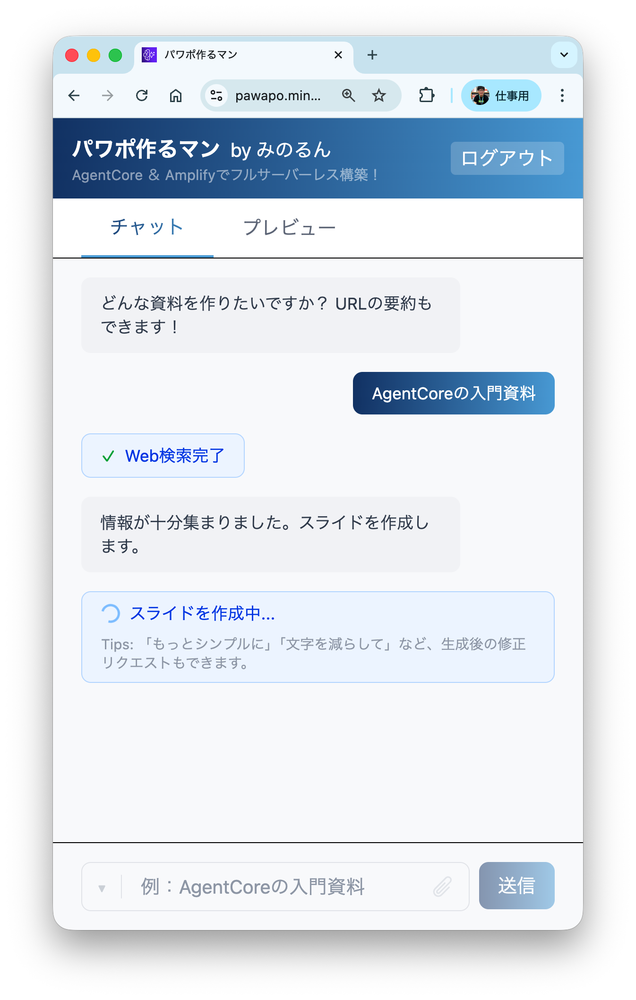
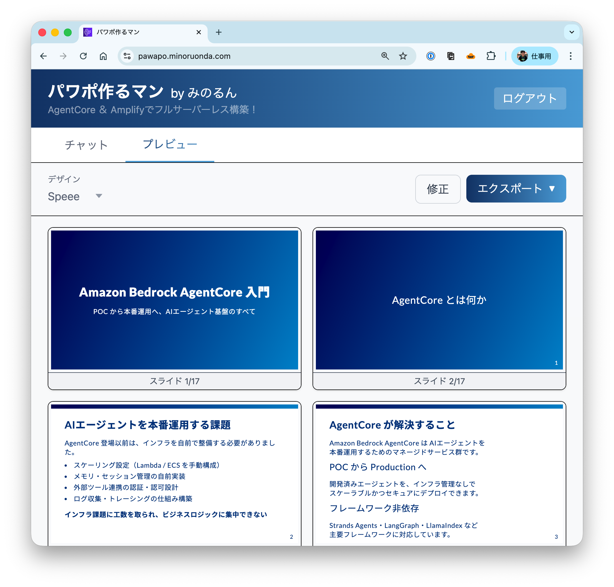

# パワポ作るマン　by みのるん

新規アカウント作成すれば、誰でも使えます！

※1日50名を超えるとエラーになります。その際は翌日までお待ちください🙏

[pawapo.minoruonda.com](https://pawapo.minoruonda.com/)

<p align="center">
    
    
</p>


## アーキテクチャ

公開中のアプリは、CloudFront から画面を配信し、ブラウザが Amazon Bedrock AgentCore Runtime へ直接つながる構成です。標準モデルは Kimi K2.5 で、維持費の中心は Bedrock の推論料金です。インフラは AWS CDK を CDKD でデプロイします。

構成の解説は [新基盤のアーキテクチャ](docs/new-architecture.html) にあります。

Git への push では本番 AWS は変わりません。本番反映は CDKD を明示実行します。

Amplify Gen2 の自己ホスト手順は [`legacy/amplify`](https://github.com/minorun365/marp-agent/tree/legacy/amplify) ブランチに残しています。


## デプロイ手順

自分のAWS環境に載せる場合の手順です。このリポジトリのデフォルト設定は作者の公開アプリ向けなので、ドメインなどの CDK context は自分の環境に合わせてください。

### 前提条件

- ARMアーキテクチャのPC（MacBookなど）
- Node.js 18以上
- Docker Desktop（起動しておく）
- AWSアカウント（リージョンはバージニア北部 `us-east-1`）
  - Bedrockプレイグラウンドから利用するモデルのユースケース送信をしておく
- [Tavily](https://tavily.com/) APIキー（無料、Web検索機能に必要）

### 1. セットアップ

```bash
git clone https://github.com/minorun365/marp-agent.git
cd marp-agent
npm install
```

### 2. 環境変数の設定

プロジェクトルートに `.env` ファイルを作成：

```
TAVILY_API_KEYS=tvly-xxxxx,tvly-yyyyy,tvly-zzzzz
```

※カンマ区切りで複数キーを指定すると、レートリミット時に自動フォールバックします。

### 3. ローカル開発

```bash
aws login
npm run dev:ui          # メイン画面だけ（AWS不要）
npm run dev             # Cognito と AgentCore ローカル
```

`cdk.json` のドメインなどの context を、自分のAWS環境に合わせてからインフラを触ってください。

```bash
npm run infra:synth
npm run infra:diff
npm run infra:dry-run
```

本番相当のデプロイは Git push とは別に、`npm run infra:deploy` を明示実行します。

Amplify Console で動かしたい場合は `legacy/amplify` ブランチを使います。

## 参考ブログ

- [アンチAI生成派の私が、パワポ作成AIを作った理由 - Findy Media](https://findy-code.io/media/articles/aisaji-minorun365)
- [Amplify & AgentCoreのAIエージェントをAWS CDKでデプロイしよう！ - Qiita](https://qiita.com/minorun365/items/0b4a980f2f4bb073a9e0)
