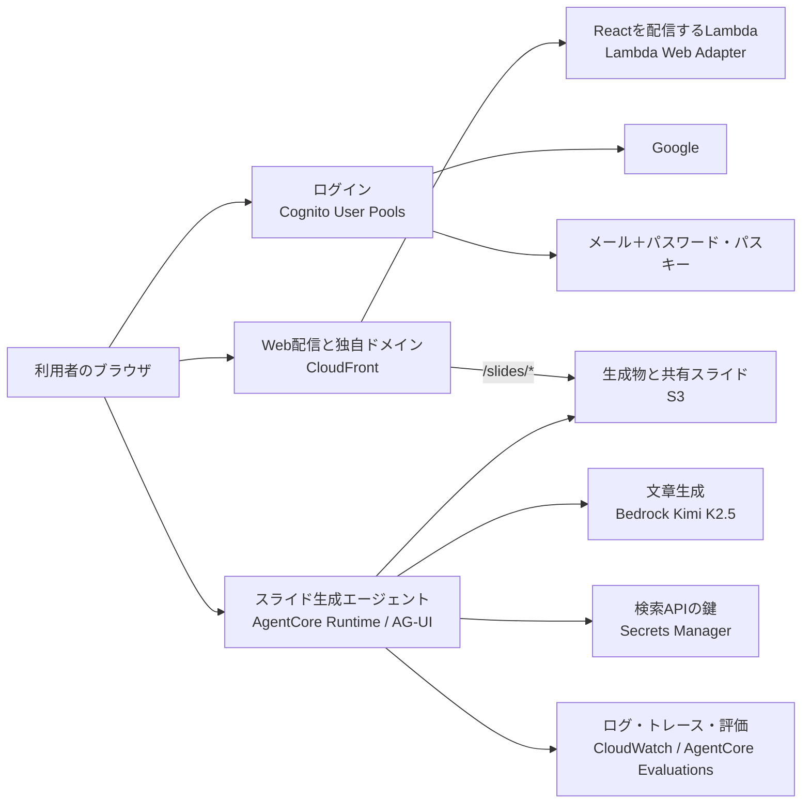

# Amplify 卒業後の移行設計

最終確認日: 2026年8月13日

> 公開本番の切替は 2026-08-14 に完了した。この文書は切替前に決めた目標構成の記録。現行の入口は [新基盤のアーキテクチャ](./new-architecture.html) と [開発ガイド](./development.md)。

## 目的

Amplify Gen 2 環境をそのまま別アカウントへ複製せず、パワポ作るマンを新しい AWS アカウントへ再構築する。既存の移行先環境には手を加えず、新環境を並行して作成してから切り替える。

この文書は移行後の目標構成を記録する。現在の実装仕様は [spec.md](./spec.md)、認証の詳細は [authentication-options.md](./authentication-options.md) を正とする。

## 決定事項

| 項目 | 決定 |
|---|---|
| AWS アカウント | 個人の AWS Organizations 配下に専用アカウントを新設する |
| リージョン | バージニア北部 `us-east-1` に統一する |
| インフラ定義 | AWS CDK の TypeScript アプリとして管理する |
| デプロイ | CDKD をローカル実行と本番デプロイに使用する。導入時の正確なバージョンを固定する |
| Web 配信 | CloudFront から Lambda Function URL を呼び、Lambda Web Adapter で React のビルド成果物を配信する |
| AI 実行基盤 | Amazon Bedrock AgentCore Runtime を使用する |
| 通信方式 | 現行の独自 SSE から AgentCore の AG-UI プロトコルへ段階的に移す |
| LLM | Kimi K2.5 を標準モデルにする |
| 認証 | Cognito User Pools。既存のメール＋パスワードを維持し、Google と任意のパスキーを追加する |
| 既存ユーザー | User Migration Trigger で、従来のパスワードを使った初回ログイン時に段階移行する |
| 会話履歴 | AgentCore Runtimeの同一セッション内で保持する。外部メモリは初期構成に入れない |
| DynamoDB | 初期構成には入れない |
| デプロイ運用 | Git への push と AWS へのデプロイを分離し、エージェント用スキルで手動実行する |

## 目標構成



### Web 配信

React は引き続き Vite でビルドする。Web Lambda は次の役割だけを持ち、AgentCore の中継はしない。

- `dist/` の静的ファイルを配信する。
- SPA の画面遷移では `index.html` へ戻す。
- 環境ごとの公開設定を `/runtime-config.json` として返す。
- ハッシュ付きアセットは長期キャッシュ、`index.html` と実行時設定はキャッシュしない。

ブラウザから AgentCore Runtime へ直接接続し、ストリーミングの途中に Web Lambda を挟まない。これにより、Lambda の実行時間や応答ストリーミングの制約を AI の生成時間へ持ち込まない。

現在のフロントエンドは静的 SPA なので、配信効率だけなら S3 と CloudFront のほうが単純である。Lambda Web Adapter を採用する理由は、同じコンテナをローカルでも実行できること、環境設定を実行時に差し込めること、将来サーバー側処理を追加しやすいことに置く。移行前の性能試験で効果が見合わなければ、フロントエンドだけ S3 配信へ戻せる境界を保つ。

### 認証

Cognito Identity Pool は作らない。ブラウザが必要とするのは User Pool のアクセストークンであり、ブラウザへ AWS 一時認証情報を渡す用途が現在はないためである。

認証画面はアプリ内に実装し、Google の OAuth 接続に Cognito のプレフィックスドメインを使用する。初期構成では Cognito のカスタムドメインを増やさない。

| 利用者 | 初回 | 2回目以降 |
|---|---|---|
| 既存ユーザー | 従来と同じメールアドレスとパスワードでログインし、User Migration Trigger で移行する | パスワードを継続。希望すればパスキーも使える |
| Google を使う新規ユーザー | Google で登録とログインを同時に完了する | Google |
| メールを使う新規ユーザー | メールアドレスとパスワードで登録し、確認コードでメールを確認する | パスワードを継続。希望すればパスキーも使える |

Google やパスキーのログインでは User Migration Trigger が起動しない。したがって、既存ユーザーは従来と同じメールアドレスとパスワードで最初の移行を行う。移行後もパスワードは廃止せず、プラットフォーム変更の都合で利用者へ認証方式の変更を強制しない。

メールによるワンタイムコードログインは採用しない。Cognito の標準メール送信は、新規登録時のメール確認とパスワード再設定だけに使う。SES の本番利用申請は初期リリースの前提にせず、標準メールの1日50通という上限が実利用で不足する段階になったら送信基盤だけを見直す。

パスキーの Relying Party ID は公開前に固定する。SDK ベースの認証画面で本番アプリのドメインを使う構成を第一候補とし、実装スパイクで Cognito のドメイン設定と Google OAuth を含めて確認してから確定する。変更後は既存のパスキーを再登録する必要があるため、公開後には変えない。

#### ログイン画面

最初の画面には「Googleで続ける」と、メールアドレス入力だけを表示する。メールを入力した次の画面では、パスキーとパスワードの両方を常に表示する。登録有無による出し分けを行わず、従来ユーザー専用の「移行」画面も作らない。移行は通常のパスワードログインの裏側で行う。

新規登録はメール画面の短い補助リンクから進み、メールアドレス、パスワード、登録確認コードの順に入力する。パスワードでログインした利用者にはパスキー登録を案内し、「あとで」で即座に閉じられるようにする。見送った場合は30日間再表示しない。専用の設定画面は作らず、メイン画面も変更しない。PC はブランド面と認証面の左右分割、スマートフォンはブランド面を短くしてフォームを主役にする。画面案は [ログイン画面デザインモック](./mocks/login-design.html) で確認できる。

### AI エージェント

- AgentCore Runtime は画面向けの標準イベント形式である AG-UI を使用する。
- Runtime の受信認証には Cognito の JWT オーソライザーを必須とする。
- 同じRuntime Session IDを指定した呼び出しは同じコンテナへ送られ、コンテナ内のStrands Agentが会話履歴を保持する。アイドル約15分、最大約8時間を上限とする一時的な履歴である。
- AgentCore Memoryや長期記憶は初期構成に含めない。15分を越えた会話の復元や、利用者の好みを別セッションへ持ち越す要件が出た時点で追加する。
- OpenTelemetry の入力、出力、ツール呼び出し、処理時間を記録し、AgentCore Evaluations で評価できる形にする。
- Tavily などの API キーは実行環境変数へ直接入れず、Secrets Manager または AgentCore Identity から取得する。
- 新しいAWSアカウントでは、AgentCoreの初回デプロイ前にCloudWatch Transaction Searchを有効化し、トレースの1%を索引化する。ログのリソースポリシー、X-Rayの保存先、索引化率はアカウント単位の初期設定として管理する。
- コンテナは ARM64 でビルドし、ECR の不変タグまたはダイジェストで Runtime の版を特定する。

現在の独自 SSE は一度に置き換えず、既存イベントを AG-UI の型付きイベントへ対応付けるアダプターを先に入れる。画面側と Runtime 側を別々に移行できる状態にする。

### データと生成物

DynamoDB は初期構成には不要である。現在必要な状態は次の AWS サービスで持てる。

| データ | 保存先 |
|---|---|
| Cognito の利用者 | Cognito User Pool |
| 会話履歴 | AgentCore Runtimeの同一セッション内（外部永続化なし） |
| 共有スライドとダウンロード用生成物 | S3 |
| インフラの状態 | CDKD の S3 状態バケット |
| 秘密情報 | Secrets Manager または AgentCore Identity |
| ログとトレース | CloudWatch |

将来、スライド一覧、利用枠、契約状態、固定の利用者 ID などを検索・更新する要件が出た場合にだけ DynamoDB を追加する。Cognito の `sub` は User Pool の再移行で変わるため、永続的な業務データを持ち始める時点で固定のアプリ利用者 ID を導入する。

PDF や PowerPoint の大きなファイルは、最終的に SSE の Base64 へ載せず、S3 の短時間だけ有効なダウンロード URL で渡す。共有スライドは Web と同じ CloudFront 配信へ統合し、`https://pawapo.minoruonda.com/slides/{id}/` を発行する。既存の共有専用ドメインは移行期間だけ残し、新しい URL への案内または転送に使う。

## CDK と CDKD の構成

### スタック分割

| スタック | 主なリソース | 更新頻度 |
|---|---|---|
| Foundation | 専用サブドメインのHosted Zone、Secrets Manager、予算通知 | 低い |
| Auth Access | 認証Lambdaの実行ロールとログ | 低い |
| Auth | Cognito User Pool、App Client、Google、移行 Lambda | 低い |
| Workload Access | AgentCoreとWeb Lambdaの実行ロール、Webログ | 低い |
| Agent | ECR、AgentCore Runtime、評価 | 高い |
| Web | Web Lambda、Function URL、CloudFront、証明書、DNS、共有用 S3 | 高い |

削除保護や保持方針はリソースごとに設定する。Cognito User Pool、生成物バケット、CDKD の状態バケットは、通常のスタック削除で消えない設定にする。

### 本番デプロイの安全策

CDKD は AWS API を直接呼び、S3 に独自状態を保存するコミュニティ製品である。2026年8月13日時点の公式 README は、開発・テスト向けであり本番準備は未完了としている。今回の本番利用では次を必須条件にする。

1. `@go-to-k/cdkd` の正確なバージョンを `devDependencies` と lockfile に固定する。
2. 専用アカウントでは最初に `cdkd bootstrap --region us-east-1` を実行し、バージョニングされた状態バケットとアセット保管先を作る。
3. 初回導入時と更新時に、対象リソースとプロパティが CDKD で対応済みか確認する。
4. `synth`、対象スタックの `diff`、`deploy --dry-run` を通してからデプロイする。
5. 本番では明示したスタックだけを `--full-wait` でデプロイし、CloudFront が配信可能になるまで待つ。
6. デプロイ後に `state show`、`events`、ドリフト検査、スモークテストを行う。
7. 状態バケットは暗号化、バージョニング、公開拒否を有効にし、別の保全先へ定期コピーする。
8. 前のコンテナイメージと Web 配信物を残し、Runtime の版戻しと `cdkd rollback` の両方を手順化する。
9. CDKD で対応できないリソースが出た場合は回避フラグで通さず、CloudFormation へ戻すかスタックを分離する。

新規アカウントのため、既存の CloudFormation スタックを CDKD へ暗黙に移管する作業は発生しない。既存の Amplify 環境は切り替え完了まで別管理のまま残す。

## ローカル開発

ローカルへ AWS を丸ごと再現せず、常設の開発環境も持たない。CDKD のローカル実行と本番の共有 AWS リソースを組み合わせ、大きな変更で公開 URL が必要なときだけ期限付きの一時スタックを作る。

| 用途 | 起動内容 | AWS との接続 |
|---|---|---|
| 画面だけを素早く直す | Vite と既存モック | なし |
| 普段の機能開発 | Vite、`cdkd local start-agentcore --watch` | Bedrock、Secrets Manager、本番 Cognito |
| 配信経路まで確認 | React をビルドし、`cdkd local start-cloudfront` と `start-agentcore` を起動 | 本番 Cognito と必要な AWS サービス |
| パスキーと Google の確認 | 必要時だけ期限付き一時 URL | 一時ドメインに対応した User Pool を一時スタックへ作る |

CDKD の `start-agentcore` は AgentCore Runtime のコンテナを一度だけ起動し、`POST /invocations`、`GET /ping`、SSE、WebSocket をローカルで提供できる。`start-cloudfront` は CloudFront Functions、S3 または Lambda Function URL のオリジン、SPA のエラー応答を再現できる。これを `start-dev` スキルから一括起動する。

実装時に用意する入口は次の4つに統一する。

```text
npm run dev:ui       # Vite + モック。画面を最速で確認
npm run dev:auth     # 新しい認証画面だけを全状態で確認
npm run dev          # Vite + ローカルAgentCore + AWS認証
npm run dev:full     # CloudFront/Lambda Web Adapter + ローカルAgentCore
```

パスキーは本番の Relying Party ID を `pawapo.minoruonda.com` に固定する。Relying Party ID は画面のドメインと一致する必要があるため、本番 User Pool のパスキーを localhost では検証できない。パスキーを触る変更だけ、一時ドメインと一時 User Pool をまとめて作り、登録、ログイン、削除、パスワードへのフォールバックを確認する。本番切り替え前には本番ドメインでも実機確認する。

### Amplify 出力の置き換え

現在は `amplify_outputs.json` をフロントエンドが直接読み込んでいる。移行後は `/runtime-config.json` に次の公開情報だけを出し、アプリ起動時に読み込む。

- Cognito のリージョン、User Pool ID、App Client ID
- Google ログインに使う Cognito ドメインとリダイレクト先
- AgentCore Runtime ARN と接続方式
- 共有スライドの公開ドメイン
- 環境名と機能フラグ

秘密情報は含めない。Web Lambda が CDK の出力から動的に返すため、同じ React ビルド成果物をローカル、一時環境、本番で使える。ローカルでは `cdkd state show` の出力から同じ形式の一時ファイルを生成する。

## エージェントが行うデプロイ運用

Git への push だけでは AWS を変更しない。次のスキルをプロジェクト内へ用意する。

| スキル | 役割 |
|---|---|
| `start-dev` | AWS の認証確認、Docker 起動、必要な設定生成、Vite と CDKD のローカル実行をまとめて開始する |
| `deploy-preview` | 必要時だけ、テスト、ビルド、CDKD の差分確認、期限付き一時環境へのデプロイを行う |
| `deploy-prod` | 本番アカウント確認、差分と置換の検査、完全待機での明示的なスタック更新、スモークテストを行う |
| `check-deploy-status` | CDKD の状態、イベント、ドリフト、Runtime と CloudFront の準備状態を確認する |

本番デプロイは、コード変更の push と自動的に連動させない。みのるんからデプロイを依頼されたときにエージェントがスキルを実行し、対象アカウント、リージョン、スタックを確認して進める。

## Amplify 卒業で引き継ぐ必要があるもの

Amplify が暗黙に担当していた機能を次のように置き換える。

| Amplify が担当していたもの | 移行後 |
|---|---|
| ブランチごとの環境 | 本番だけを常設し、必要時だけ期限付き一時スタックを作る |
| バックエンド出力の生成 | `/runtime-config.json` と CDKD 状態からのローカル設定生成 |
| フロントエンドのビルドと配信 | Vite、Web Lambda、Lambda Web Adapter、CloudFront |
| Cognito の作成と UI 設定 | CDK の Auth スタックとアプリ内の Amplify Auth クライアント |
| 独自ドメインと証明書 | Route 53 の委任、ACM、CloudFront を CDK で管理 |
| 環境変数 | CDK の公開設定と Secrets Manager を明確に分離 |
| Sandbox の起動 | CDKD のローカル実行。常設の開発用 AWS 環境は持たない |
| デプロイ履歴と復旧 | CDKD の状態・イベント・ドリフト、ECR の版、復旧スキル |
| プレビュー環境 | 原則廃止。大きな変更だけ一時スタックを作る |

追加で見落としやすい項目は次のとおり。

- 新しい AWS アカウントで Bedrock、AgentCore、Lambda、Cognito 標準メールのクォータとモデル利用可否を実測する。
- AWS Organizations のクレジット共有と、Kimi K2.5 の費用へクレジットが適用されるか請求画面で確認する。
- Google OAuth の許可済みリダイレクト URL を localhost、本番、必要時の一時 URL へ登録する。
- Cognito 標準メールを登録確認とパスワード再設定に限定し、1日50通の上限を監視する。
- 旧アカウントには移行 Lambda が AssumeRole する最小権限ロールを残す。
- 既存ユーザーと Google ユーザーを、確認済みメールアドレスだけで安全にリンクする。
- WAF、利用回数の予算通知、AgentCore と Bedrock のエラー率・遅延・トークン量のアラームを設定する。
- ログに会話内容が残る前提で、暗号化、保存期間、削除方針を決める。
- 旧環境の共有 URL をいつまで維持するか決め、切り替え直後に消さない。
- 切り戻し時、新環境で新規登録した利用者は旧 User Pool に存在しないことを運用手順へ書く。
- DNS の TTL を事前に下げ、切り替え後は旧環境を読み取り可能な状態で残す。
- 新しいアカウントのバックアップ連絡先、予算、CloudTrail、IAM Identity Center、緊急アクセスを先に整える。

## 移行順序

1. 専用 AWS アカウントを作成し、請求、監査、緊急アクセス、CDKD の状態保全を設定する。
2. CDKD が Cognito、AgentCore、CloudFront、Lambda などの必要なリソースを扱えるか、最小スタックで確認する。
3. ローカル起動を先に完成させる。
4. Cognito と User Migration Trigger を構築し、既存ユーザー、新規ユーザー、Google、パスワード、パスキーを確認する。
5. AgentCore Runtime を AG-UI、Runtime Session、Observability 対応で移す。
6. Web Lambda と CloudFront を構築し、現在の画面を接続する。
7. 共有スライドと生成物の保存先を移し、既存 URL の維持方法を確認する。
8. PC と iPhone で E2E テストを行う。
9. DNS を切り替え、旧環境を残したまま監視する。
10. 利用者の段階移行が進んだ後、移行期間の終了条件を確認して旧環境を縮退する。

## 実装前に行う3つのスパイク

1. Lambda Web Adapter で静的 SPA を配信し、初回応答、キャッシュ、実行時設定の差し込みを測る。
2. Cognito の SDK ベースのパスキー、Google OAuth、既存ユーザー移行を同じ User Pool で通す。
3. CDKD で AgentCore Runtime、CloudFront、Cognito を作成・更新・ロールバックし、対応状況と状態復旧を確認する。

この3点が通ってから本体の移植へ進む。実装の途中で CDKD の未対応項目が見つかった場合は、無理に回避せずスタック分離または CloudFormation 管理への切り替えを判断する。

## 参考資料

- [CDKD](https://github.com/go-to-k/cdkd)
- [CDKD のローカル実行](https://github.com/go-to-k/cdkd/blob/main/docs/local-emulation.md)
- [AWS Lambda Web Adapter](https://github.com/aws/aws-lambda-web-adapter)
- [AgentCore Runtime の AG-UI](https://docs.aws.amazon.com/bedrock-agentcore/latest/devguide/runtime-agui.html)
- [Cognito の認証方式](https://docs.aws.amazon.com/cognito/latest/developerguide/authentication.html)
- [Cognito のパスキーと認証フロー](https://docs.aws.amazon.com/cognito/latest/developerguide/amazon-cognito-user-pools-authentication-flow-methods.html)
- [Cognito User Migration Trigger](https://docs.aws.amazon.com/cognito/latest/developerguide/user-pool-lambda-migrate-user.html)
