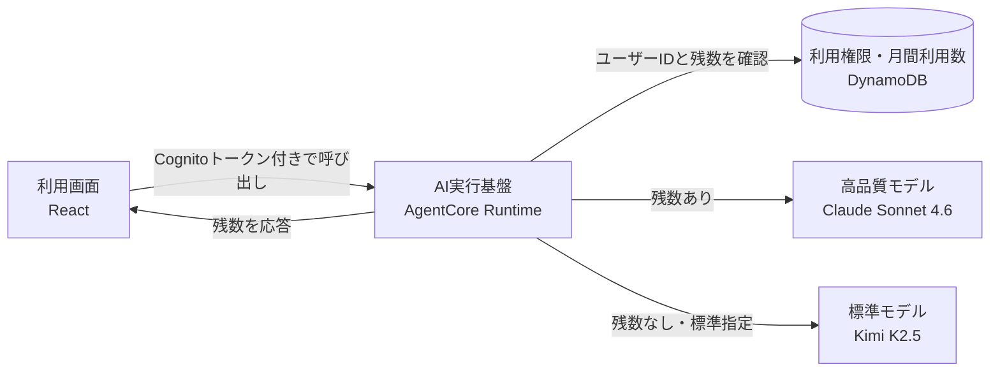

# Sonnet 4.6 月間利用枠・将来サブスクリプション設計

更新日: 2026年8月14日
状態: 設計方針を合意済み、実装は未着手。
2026-08-19に選択肢へGrok 4.6が加わったので、上位モデルをSonnet 4.6とGrok 4.6のどちらにするかは
実利用の費用と品質を見てから決める。無料枠の考え方（利用権限データの持ち方、原価測定の順序）は変わらない。

## 1. 決定事項

一般公開版のパワポ作るマンでは、Claude Sonnet 4.6を1アカウントにつき月1セッションだけ利用できるようにする。標準モデルのKimi K2.5は、Sonnetの残数に関係なく利用できる状態を維持する。

利用枠の見せ方は、ユーザーに選ばせる方式ではなく**自動でお試しさせる方式**を採る。

1. 残数があるユーザーには、モデル選択の初期値としてSonnetを自動で選んでおく。ユーザーは何も操作せず、初回のスライド生成をSonnetで体験する
2. 枠を使い切った次のセッションでは、初期値が自動でKimiへ戻る
3. 切り替わったことは、モデル選択プルダウンの近くに出る控えめなツールチップだけで伝える。生成をブロックしたり、専用の画面を挟んだりしない

将来のサブスクリプション追加を見越して、無料枠と有料プランを同じ利用権限データで管理する。ただし、初回リリースには決済機能を含めない。まず月1セッションの無料枠を提供し、実際の原価と利用状況を測定する。

### 従来案（月2回・ユーザーが選択）からの変更理由

自分でモデルを切り替えたユーザーしかSonnetに触れられない設計では、品質差を体験する人が一部に限られ、有料プランを検討する動機も生まれない。初期値をSonnetにすると、全ユーザーが確実に品質差を体験してからKimiへ戻ることになる。

その代わり、Sonnetの消費率がほぼ100%になる。上限を月2回のまま自動選択にすると原価が読みにくいため、上限を月1回へ下げて、1ユーザーあたりの月間上限額を従来案の半分に抑える。

## 2. 「1回」の定義

Sonnetの1回分は、1つのAgentCoreセッションとして数える。

- 新しいセッションで最初にSonnetを呼び出した時点で1回消費する
- 同じセッション内の修正依頼は追加で消費しない
- 画面の再読み込みなどで新しいセッションIDになった場合は、新たに1回消費する
- X共有文の作成など、画面が自動実行する補助処理にはKimiを使う
- 認証や利用枠の判定で処理が止まり、モデルを呼び出していない場合は消費しない
- モデル呼び出し開始後の失敗は、AWS利用料が発生するため消費済みとして扱う

この単位は、既存のコスト集計がAgentCoreセッション単位であること、生成後の修正まで同じ作業として扱えることから採用した。

## 3. 現状との差分

| 項目 | 現在 | 対応後 |
|---|---|---|
| Sonnetの選択 | 「資金不足により停止中」と表示し、選択不可 | 残数があれば初期選択され、残数がなければ選択不可 |
| モデルの初期値 | 常にKimi固定（`useChatMessages.ts` の `useState<ModelType>('kimi')`） | 残数の取得結果で決まる |
| 利用回数 | 記録なし | アカウントごとに月1セッション |
| 判定場所 | 画面の選択肢だけ | AgentCore Runtimeで必ず判定 |
| ユーザー識別 | Cognitoトークンを認証にだけ使用 | 検証済みトークンの `sub` を利用枠のキーに使用 |
| 月次更新 | なし | 年月をDynamoDBのキーに含め、リセット処理を不要にする |
| 枠切れの伝え方 | なし | プルダウン近くのツールチップだけで伝える |
| 有料プラン | なし | 利用権限データだけ先に用意し、決済は後から追加 |

## 4. 初期選択とフォールバックの体験設計

今回の設計で新しく決めるのはここだけで、以降の章は従来案からの微修正になる。

### 初期選択の決め方

画面の初期表示で `get_usage` を呼び、その結果で初期モデルを決める。

| 状態 | 初期選択 | プルダウンの表示 |
|---|---|---|
| 残数1（今月未使用） | Sonnet | `高品質（Claude Sonnet 4.6・今月あと1回）` |
| 残数0（今月使用済み） | Kimi | Sonnetは選択不可、`高品質（Claude Sonnet 4.6・来月また使えます）` |
| 有料プラン | Sonnet | `高品質（Claude Sonnet 4.6・使い放題）` |

`get_usage` の応答が遅い、または失敗した場合はKimiを初期選択にする。読み込み中にSonnetを表示してからKimiへ戻る動きは、切り替わりが目に入って紛らわしいので避ける。

### ツールチップ

枠を使い切ったユーザーが次のセッションを開いたとき、モデル選択プルダウンの近くへ小さく表示する。

> **Claudeのお試し枠を使い切りました**
> 標準モデル（Kimi K2.5）に切り替えています。来月また1回使えます。

表示のルールは次のとおり。

- 表示条件は「今月Sonnetを消費済みで、残数が0」。一度もSonnetを使っていないユーザーには出さない
- 同じ月に何度も出さない。閉じた記録は `localStorage` へ対象月（`2026-08`）をキーにして保存する
- 数秒で自動的に消え、閉じるボタンでも消せる。入力欄やボタンを覆わない
- モーダル、確認ダイアログ、生成のブロックは行わない
- ツールチップを見逃しても困らないよう、プルダウンのラベル側にも `来月また使えます` を残す

### 送信直前に枠が尽きた場合

別のタブや別の端末で先に枠を使うと、画面の残数が古いままSonnetで送信されることがある。この場合はAgentCore Runtimeが `SONNET_QUOTA_EXCEEDED` を返す。

このときの画面側の動作は次のとおり。

1. モデル選択をKimiへ切り替える
2. 同じ依頼をそのままKimiで1回だけ送り直す
3. 上のツールチップを表示する

拒否はモデル呼び出し前に行われるため、この再送でSonnet枠は消費されず、AWSの二重課金も発生しない。エラー画面を出さずに生成を続けることを優先する。ただし**無言でモデルを差し替えることはしない**。切り替えたことは必ずツールチップで伝える。

### この方式の副作用

- 初めて触ったときが最も品質の高い体験になり、2回目以降は品質が下がる。狙いどおりの動機付けになる一方、期待外れと受け取られる可能性もある。ツールチップの文面は「終了しました」ではなく「来月また使えます」と、回復することを前面に出す
- 全アクティブユーザーがSonnetを1回消費する前提になるため、月間原価はほぼ「アクティブユーザー数 × 1セッション単価」で決まる（第10章）

## 5. 最小構成

既存の「ブラウザからAgentCore Runtimeを直接呼ぶ」構成を維持する。利用枠のためにAPI Gatewayや別の認証基盤は追加しない。



AgentCore Runtimeへ `Authorization` ヘッダーを渡す設定を追加する。Runtimeが検証済みのJWTから `sub` を取得し、DynamoDBで利用権限を確認する。ブラウザから送られたユーザーIDは信用しない。

## 6. DynamoDBのデータ設計

テーブルは1つにまとめる。物理名はCDKに任せ、公開リポジトリへAWSアカウント固有の値を記載しない。

| PK | SK | 主な属性 | 用途 |
|---|---|---|---|
| `USER#<sub>` | `PLAN` | `plan`, `status`, `currentPeriodEnd`, Stripe識別子 | 無料・有料プランの判定 |
| `USER#<sub>` | `MONTH#2026-08` | `usedSessionCount`, `updatedAt`, `expiresAt` | 月間利用数 |
| `USER#<sub>` | `SESSION#<sessionId>` | `periodKey`, `model`, `createdAt`, `expiresAt` | 同一セッションの二重消費防止 |

無料枠の上限は環境変数で持ち、コードへ `1` を直接書かない。原価の実測後に上限を変える判断が出やすいうえ、有料プランの `limit=null`（使い放題）と同じ判定処理を使い回せる。

無料ユーザーが新しいSonnetセッションを開始するときは、DynamoDBのトランザクションで次の2件を同時に更新する。

1. 月間利用数が上限未満であることを確認し、`usedSessionCount` を1増やす
2. セッション記録が存在しないことを確認し、セッション項目を追加する

同じセッション項目がすでに存在する場合は、月間利用数を増やさずにSonnetを利用できる。並行して複数リクエストが届いても、条件付き更新によって上限超過分をモデル呼び出し前に拒否する。

月間項目とセッション項目には有効期限を設定し、集計に必要な期間だけ保持する。`PLAN` 項目は継続して保持する。

## 7. AgentCore Runtimeの処理

### 残数取得

画面の初期表示時に `action=get_usage` を呼び出す。この処理はモデルを呼び出さず、次の情報だけを返す。

```json
{
  "plan": "free",
  "limit": 1,
  "used": 0,
  "remaining": 1,
  "period": "2026-08",
  "defaultModel": "sonnet"
}
```

`defaultModel` はバックエンドが決めて返す。画面側が残数から初期モデルを組み立てると、上限を変更したときに両方を直す必要が出るため、判定はバックエンドに寄せる。

### Sonnet呼び出し

1. AgentCore Runtimeが検証済みJWTから `sub` を取得する
2. リクエストされたモデルがSonnetの場合だけ、プランとセッション記録を確認する
3. 新しい無料セッションなら、月間利用数とセッション記録をトランザクションで更新する
4. 利用可能な場合だけSonnetを呼び出す
5. 応答イベントへ最新の残数を含める

利用枠を超えた場合は `SONNET_QUOTA_EXCEEDED` を返す。**バックエンドは勝手にKimiで実行しない**。切り替えは画面側の責務とし、ユーザーへツールチップを見せたうえでKimiとして送り直す（第4章）。バックエンドが黙って差し替えると、どのモデルで生成したのかがログとユーザーの認識の両方でずれる。

現在の `normalize_model_type()` は、有効でないモデルをKimiへ置き換える役割だけを持つ。Sonnetを有効化するときは、正規化の前に利用権限を確認する処理を追加する。

## 8. 画面表示

モデル選択肢は次の表示へ変更する。

- 残数がある場合: `高品質（Claude Sonnet 4.6・今月あと1回）`
- 残数がない場合: `高品質（Claude Sonnet 4.6・来月また使えます）`（選択不可）
- 有料プランの場合: `高品質（Claude Sonnet 4.6・使い放題）`

現在の実装では `useChatMessages.ts` がモデルの状態を `useState<ModelType>('kimi')` で初期化している。ここを `get_usage` の `defaultModel` で初期化する形へ変える。あわせて `types.ts` の `MODEL_OPTIONS` から、Sonnetの `disabled: true` と「資金不足により停止中」の表記を外し、`config.py` の `ENABLED_MODEL_TYPES` へ `sonnet` を追加する。

画面の制御は案内のためのものであり、最終判定は必ずAgentCore Runtimeで行う。

同じSonnetセッション内で残数が0になっても、そのセッションの修正依頼は継続できる。新しいセッションを始めた時点で、残数がなければSonnetを利用できない。

## 9. 将来のサブスクリプション

決済を追加するときは、Stripeが用意するCheckoutと顧客ポータルを使う。カード入力画面、解約画面、請求履歴画面は自作しない。

追加するバックエンドは、次の3経路に絞る。

| 経路 | 認証 | 役割 |
|---|---|---|
| `POST /billing/checkout` | Cognito | ログイン中のユーザー用Checkoutを作成 |
| `POST /billing/portal` | Cognito | Stripe顧客ポータルを作成 |
| `POST /billing/webhook` | Stripe署名 | 契約開始、更新、支払い失敗、解約を反映 |

Checkout作成時にCognitoの `sub` をStripeのメタデータへ保存する。決済完了後の戻り先画面を根拠に利用権限を付与せず、署名を検証したWebhookだけがDynamoDBの `PLAN` 項目を更新する。

StripeのAPIキーとWebhook署名用シークレットはSecrets Managerで管理する。Cognitoのカスタム属性へプランを保存すると、トークン更新まで古い状態が残るため、DynamoDBを利用権限の正本とする。

枠切れのツールチップは、決済を追加した段階で申し込み導線の置き場所になる。初回実装ではリンクを置かず、文面と表示位置だけ先に決めておく。

## 10. 月額150円の採算条件

Claude Sonnet 4.6の公開価格は、100万入力トークンあたり3ドル、100万出力トークンあたり15ドル。既存の実績資料では、Sonnet系のセッション単価は約0.34ドルから0.59ドルだった。

計画用に1ドル150円で換算すると、1セッションあたり約51円から89円になる。Stripeの国内カード決済3.6%とBilling 0.7%を差し引くと、月額150円から残る金額は約144円である。税金やその他の運用費はこの計算に含めていない。

| 試算項目 | 金額・回数 |
|---|---:|
| Sonnet 1セッション | 約51円から89円 |
| 無料枠1セッション（1ユーザーあたり月額） | 約51円から89円 |
| 月間アクティブ100人あたりの無料枠原価 | 約5,100円から8,900円 |
| 月額150円の決済手数料控除後 | 約144円 |
| 月額150円で賄えるSonnetセッション | 約1.6回から2.8回 |

**自動選択にすると「上限額」がそのまま「実額」に近づく。** 従来案のようにユーザーが自分で切り替える方式なら、枠を持っていても使わない人が相当数いるため、実際の原価は上限のごく一部で済んでいた。初期選択をSonnetにする以上、月間アクティブユーザー数へ単価をそのまま掛けた金額を予算とみなす。上限を月2回から月1回へ下げたのはこのためである。

この原価では、月額150円で文字どおりの使い放題を提供すると、少数回の利用で赤字になる可能性が高い。150円を維持する場合は、採算商品ではなく原価を一部負担する「支援者向けベータ」として扱う必要がある。

正式な使い放題プランの価格は、月1回枠を1か月から2か月運用し、次の実測値を確認してから決める。

- Sonnetセッション原価の中央値と上位利用者の値
- 月間アクティブユーザーのうち、実際にSonnetを消費した割合（自動選択なので100%に近い想定。乖離があれば前提を見直す）
- 枠を使い切ったあとも継続してKimiで利用しているユーザーの割合
- 有料化した場合の利用増加

設計上は `limit=null` を使い放題として扱えるようにする。価格を決め直しても、利用枠の実装を作り直さずに済む。

## 11. コストと不正利用への備え

初回実装では、複雑な従量課金や利用量メーターを作らない。次の項目だけを追加する。

- 1ユーザーが同時に開始できるSonnetセッションを1つに制限する
- 利用許可、利用拒否、プラン種別、Sonnetセッション開始数をCloudWatchへ記録する
- 公開版の月間AWS予算と異常コスト通知を設定する
- アプリ全体でSonnetを一時停止できる設定を用意する

**全体停止の設定を入れたときは、初期選択もKimiへ戻す。** `get_usage` が返す `defaultModel` を停止設定と連動させ、停止中は残数の有無にかかわらず `kimi` を返す。画面側だけで初期値を決めていると、停止しても全ユーザーがSonnetを選んだ状態で送信し続けることになる。

初期選択がSonnetになる以上、アカウントを作り直すだけで枠が増える。無料枠が1回であればアカウント作成の手間に見合わないと判断し、初回実装では端末単位の追加制限を設けない。悪用が実測で見えた場合に、その時点で対処を決める。

「使い放題」と表示するプランへ、説明のない日次上限は設定しない。上限が必要になった場合は、価格またはプラン名称も合わせて見直す。

## 12. 実装の順序

### 第1段階: 月1回枠と自動フォールバック

1. DynamoDBテーブルとAgentCore Runtimeの権限を追加する
2. `Authorization` ヘッダーをRuntimeへ渡し、検証済みJWTから `sub` を取得する
3. 月間利用数とセッション記録を原子的に更新する処理を追加する
4. `get_usage` と残数イベントを追加し、`defaultModel` を返す
5. `useChatMessages.ts` の初期モデルを `defaultModel` 由来へ変える
6. モデル選択肢の表記を残数つきへ変え、`disabled` と `ENABLED_MODEL_TYPES` を切り替える
7. 枠切れのツールチップと、`SONNET_QUOTA_EXCEEDED` を受けた自動再送を実装する
8. 補助処理をKimi固定にする
9. 単体テスト、並行呼び出しテスト、E2Eテストを実施する

### 第2段階: 原価測定

1か月から2か月運用し、Sonnetの消費率とセッション原価を確認する。無料枠の上限、プラン価格、使い放題の可否は、この結果を基に決める。

### 第3段階: サブスクリプション

Stripe Checkout、顧客ポータル、Webhookを追加する。無料枠で使っているDynamoDBの `PLAN` 項目をそのまま更新し、AgentCore Runtime側の判定処理は共用する。枠切れのツールチップへ申し込み導線を足す。

## 13. 初回実装に含めないもの

- Stripeとの接続
- 独自の決済画面・解約画面
- 枠切れを知らせるモーダル・専用ページ・メール通知
- API Gatewayを経由したAgentCore呼び出しへの全面変更
- Cognitoカスタム属性によるプラン管理
- 月初の定期リセット処理
- トークン単位のユーザー課金
- 複数アカウント作成による枠の取り直しへの対策

## 14. 完了条件

- 今月Sonnetを使っていないユーザーは、何も操作せずSonnetでスライドを生成できる
- 同じセッション内の修正で回数が増えない
- 2つ目のセッションでは初期選択がKimiになり、ツールチップが1度だけ表示される
- 2つ目以降のSonnet指定は、モデル呼び出し前にバックエンドで拒否される
- 拒否されたときは画面がKimiへ切り替えて生成を継続し、エラー画面を出さない
- 並行呼び出しでも上限を超えない
- Kimiと補助処理はSonnet枠を消費しない
- 月が変わると定期処理なしで新しい1回分を利用でき、初期選択もSonnetへ戻る
- 全体停止の設定を有効にすると、残数の有無にかかわらず初期選択がKimiになる
- 将来 `PLAN` 項目を有料へ変更するだけで利用上限を切り替えられる

## 参考資料

- [AgentCore Runtimeへカスタムヘッダーを渡す](https://docs.aws.amazon.com/bedrock-agentcore/latest/devguide/runtime-header-allowlist.html)
- [AgentCore RuntimeのJWT認証とクレーム取得](https://docs.aws.amazon.com/bedrock-agentcore/latest/devguide/runtime-oauth.html)
- [Claude Sonnet 4.6のAWS Marketplace料金](https://aws.amazon.com/marketplace/pp/prodview-o6w4hyizv7g64)
- [Stripeの料金](https://stripe.com/jp/pricing)
- [StripeサブスクリプションのWebhook](https://docs.stripe.com/billing/subscriptions/webhooks)
- [Stripe顧客ポータル](https://docs.stripe.com/customer-management)
- [既存のコスト実績](./report-2026-02-19.md)
