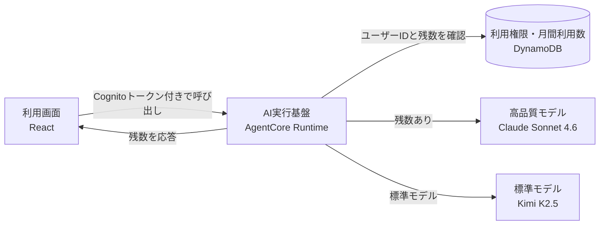

# Sonnet 4.6 月間利用枠・将来サブスクリプション設計

更新日: 2026年8月14日
状態: 設計方針を合意済み、実装は未着手

## 1. 決定事項

一般公開版のパワポ作るマンでは、Claude Sonnet 4.6を1アカウントにつき月2セッションまで利用できるようにする。標準モデルのKimi K2.5は、Sonnetの残数に関係なく利用できる状態を維持する。

将来のサブスクリプション追加を見越して、無料枠と有料プランを同じ利用権限データで管理する。ただし、初回リリースには決済機能を含めない。まず月2セッションの無料枠を提供し、実際の原価と利用状況を測定する。

## 2. 「1回」の定義

Sonnetの1回分は、1つのAgentCoreセッションとして数える。

- 新しいセッションで最初にSonnetを呼び出した時点で1回消費する
- 同じセッション内の修正依頼は追加で消費しない
- 画面の再読み込みなどで新しいセッションIDになった場合は、新たに1回消費する
- X共有文の作成など、画面が自動実行する補助処理にはKimiを使う
- 認証や利用枠の判定で処理が止まり、モデルを呼び出していない場合は消費しない
- モデル呼び出し開始後の失敗は、AWS利用料が発生するため消費済みとして扱う

この単位は、既存のコスト集計がAgentCoreセッション単位であること、生成後の修正まで同じ作業として扱えることから採用した。

## 3. 現状との差分

| 項目 | 現在 | 対応後 |
|---|---|---|
| Sonnetの選択 | 「資金不足により停止中」と表示し、選択不可 | 今月の残数を表示し、残数があれば選択可能 |
| 利用回数 | 記録なし | アカウントごとに月2セッション |
| 判定場所 | 画面の選択肢だけ | AgentCore Runtimeで必ず判定 |
| ユーザー識別 | Cognitoトークンを認証にだけ使用 | 検証済みトークンの `sub` を利用枠のキーに使用 |
| 月次更新 | なし | 年月をDynamoDBのキーに含め、リセット処理を不要にする |
| 有料プラン | なし | 利用権限データだけ先に用意し、決済は後から追加 |

## 4. 最小構成

既存の「ブラウザからAgentCore Runtimeを直接呼ぶ」構成を維持する。月2回枠のためにAPI Gatewayや別の認証基盤は追加しない。



AgentCore Runtimeへ `Authorization` ヘッダーを渡す設定を追加する。Runtimeが検証済みのJWTから `sub` を取得し、DynamoDBで利用権限を確認する。ブラウザから送られたユーザーIDは信用しない。

## 5. DynamoDBのデータ設計

テーブルは1つにまとめる。物理名はCDKに任せ、公開リポジトリへAWSアカウント固有の値を記載しない。

| PK | SK | 主な属性 | 用途 |
|---|---|---|---|
| `USER#<sub>` | `PLAN` | `plan`, `status`, `currentPeriodEnd`, Stripe識別子 | 無料・有料プランの判定 |
| `USER#<sub>` | `MONTH#2026-08` | `usedSessionCount`, `updatedAt`, `expiresAt` | 月間利用数 |
| `USER#<sub>` | `SESSION#<sessionId>` | `periodKey`, `model`, `createdAt`, `expiresAt` | 同一セッションの二重消費防止 |

無料ユーザーが新しいSonnetセッションを開始するときは、DynamoDBのトランザクションで次の2件を同時に更新する。

1. 月間利用数が2未満であることを確認し、`usedSessionCount` を1増やす
2. セッション記録が存在しないことを確認し、セッション項目を追加する

同じセッション項目がすでに存在する場合は、月間利用数を増やさずにSonnetを利用できる。並行して複数リクエストが届いても、条件付き更新によって3回目をモデル呼び出し前に拒否する。

月間項目とセッション項目には有効期限を設定し、集計に必要な期間だけ保持する。`PLAN` 項目は継続して保持する。

## 6. AgentCore Runtimeの処理

### 残数取得

画面の初期表示時に `action=get_usage` を呼び出す。この処理はモデルを呼び出さず、次の情報だけを返す。

```json
{
  "plan": "free",
  "limit": 2,
  "used": 1,
  "remaining": 1,
  "period": "2026-08"
}
```

### Sonnet呼び出し

1. AgentCore Runtimeが検証済みJWTから `sub` を取得する
2. リクエストされたモデルがSonnetの場合だけ、プランとセッション記録を確認する
3. 新しい無料セッションなら、月間利用数とセッション記録をトランザクションで更新する
4. 利用可能な場合だけSonnetを呼び出す
5. 応答イベントへ最新の残数を含める

利用枠を超えた場合は `SONNET_QUOTA_EXCEEDED` を返し、Kimiへ黙って置き換えない。画面側が説明を表示し、次の送信から標準モデルを選択する。

現在の `normalize_model_type()` は、有効でないモデルをKimiへ置き換える役割だけを持つ。Sonnetを有効化するときは、正規化の前に利用権限を確認する処理を追加する。

## 7. 画面表示

モデル選択肢は次の表示へ変更する。

- 残数がある場合: `高品質（Claude Sonnet 4.6・今月あと2回）`
- 残数がない場合: `高品質（Claude Sonnet 4.6・今月分を利用済み）`
- 有料プランの場合: `高品質（Claude Sonnet 4.6・使い放題）`

残数が0ならSonnetを選択不可にする。ただし、画面の制御は案内のためのものであり、最終判定は必ずAgentCore Runtimeで行う。

同じSonnetセッション内で残数が0になっても、そのセッションの修正依頼は継続できる。新しいセッションを始めた時点で、残数がなければSonnetを利用できない。

## 8. 将来のサブスクリプション

決済を追加するときは、Stripeが用意するCheckoutと顧客ポータルを使う。カード入力画面、解約画面、請求履歴画面は自作しない。

追加するバックエンドは、次の3経路に絞る。

| 経路 | 認証 | 役割 |
|---|---|---|
| `POST /billing/checkout` | Cognito | ログイン中のユーザー用Checkoutを作成 |
| `POST /billing/portal` | Cognito | Stripe顧客ポータルを作成 |
| `POST /billing/webhook` | Stripe署名 | 契約開始、更新、支払い失敗、解約を反映 |

Checkout作成時にCognitoの `sub` をStripeのメタデータへ保存する。決済完了後の戻り先画面を根拠に利用権限を付与せず、署名を検証したWebhookだけがDynamoDBの `PLAN` 項目を更新する。

StripeのAPIキーとWebhook署名用シークレットはSecrets Managerで管理する。Cognitoのカスタム属性へプランを保存すると、トークン更新まで古い状態が残るため、DynamoDBを利用権限の正本とする。

## 9. 月額150円の採算条件

Claude Sonnet 4.6の公開価格は、100万入力トークンあたり3ドル、100万出力トークンあたり15ドル。既存の実績資料では、Sonnet系のセッション単価は約0.34ドルから0.59ドルだった。

計画用に1ドル150円で換算すると、1セッションあたり約51円から89円になる。Stripeの国内カード決済3.6%とBilling 0.7%を差し引くと、月額150円から残る金額は約144円である。税金やその他の運用費はこの計算に含めていない。

| 試算項目 | 金額・回数 |
|---|---:|
| Sonnet 1セッション | 約51円から89円 |
| 無料枠2セッション | 約102円から177円 |
| 月額150円の決済手数料控除後 | 約144円 |
| 月額150円で賄えるSonnetセッション | 約1.6回から2.8回 |

この原価では、月額150円で文字どおりの使い放題を提供すると、少数回の利用で赤字になる可能性が高い。150円を維持する場合は、採算商品ではなく原価を一部負担する「支援者向けベータ」として扱う必要がある。

正式な使い放題プランの価格は、月2回枠を1か月から2か月運用し、次の実測値を確認してから決める。

- Sonnetセッション原価の中央値と上位利用者の値
- 1ユーザーあたりの月間Sonnetセッション数
- 無料枠を2回とも使うユーザーの割合
- 有料化した場合の利用増加

設計上は `limit=null` を使い放題として扱えるようにする。価格を決め直しても、利用枠の実装を作り直さずに済む。

## 10. コストと不正利用への備え

初回実装では、複雑な従量課金や利用量メーターを作らない。次の項目だけを追加する。

- 1ユーザーが同時に開始できるSonnetセッションを1つに制限する
- 利用許可、利用拒否、プラン種別、Sonnetセッション開始数をCloudWatchへ記録する
- 公開版の月間AWS予算と異常コスト通知を設定する
- アプリ全体でSonnetを一時停止できる設定を用意する

「使い放題」と表示するプランへ、説明のない日次上限は設定しない。上限が必要になった場合は、価格またはプラン名称も合わせて見直す。

## 11. 実装の順序

### 第1段階: 月2回枠

1. DynamoDBテーブルとAgentCore Runtimeの権限を追加する
2. `Authorization` ヘッダーをRuntimeへ渡し、検証済みJWTから `sub` を取得する
3. 月間利用数とセッション記録を原子的に更新する処理を追加する
4. `get_usage` と残数イベントを追加する
5. モデル選択肢へ残数を表示する
6. 補助処理をKimi固定にする
7. 単体テスト、並行呼び出しテスト、E2Eテストを実施する

### 第2段階: 原価測定

1か月から2か月運用し、Sonnetの利用率とセッション原価を確認する。無料枠の上限、プラン価格、使い放題の可否は、この結果を基に決める。

### 第3段階: サブスクリプション

Stripe Checkout、顧客ポータル、Webhookを追加する。無料枠で使っているDynamoDBの `PLAN` 項目をそのまま更新し、AgentCore Runtime側の判定処理は共用する。

## 12. 初回実装に含めないもの

- Stripeとの接続
- 独自の決済画面・解約画面
- API Gatewayを経由したAgentCore呼び出しへの全面変更
- Cognitoカスタム属性によるプラン管理
- 月初の定期リセット処理
- トークン単位のユーザー課金

## 13. 完了条件

- 無料ユーザーが1か月に新しいSonnetセッションを2つまで開始できる
- 同じセッション内の修正で回数が増えない
- 3つ目のセッションは、モデル呼び出し前にバックエンドで拒否される
- 並行呼び出しでも上限を超えない
- 画面に残数が表示され、0回では選択できない
- Kimiと補助処理はSonnet枠を消費しない
- 月が変わると定期処理なしで新しい2回分を利用できる
- 将来 `PLAN` 項目を有料へ変更するだけで利用上限を切り替えられる

## 参考資料

- [AgentCore Runtimeへカスタムヘッダーを渡す](https://docs.aws.amazon.com/bedrock-agentcore/latest/devguide/runtime-header-allowlist.html)
- [AgentCore RuntimeのJWT認証とクレーム取得](https://docs.aws.amazon.com/bedrock-agentcore/latest/devguide/runtime-oauth.html)
- [Claude Sonnet 4.6のAWS Marketplace料金](https://aws.amazon.com/marketplace/pp/prodview-o6w4hyizv7g64)
- [Stripeの料金](https://stripe.com/jp/pricing)
- [StripeサブスクリプションのWebhook](https://docs.stripe.com/billing/subscriptions/webhooks)
- [Stripe顧客ポータル](https://docs.stripe.com/customer-management)
- [既存のコスト実績](./report-2026-02-19.md)
